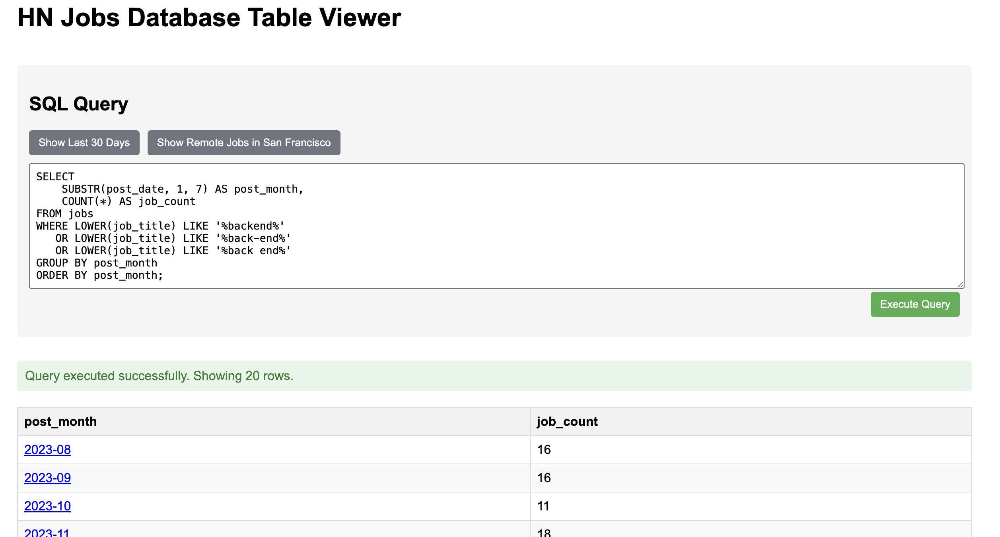

# hackernews-whos-hiring

Automatically scraps and parses monthly hackernew's who's hiring thread into easy to read markdown table and web accessible [SQLite database](https://amber-williams.github.io/hackernews-whos-hiring/).



## Running the repo

### Prerequisites

- Python 3.10+
- poetry
- copy .env.example to .env and add your API keys

### Steps

```bash
poetry install
poetry run python main.py
poetry run python final_report.py
```

#### Tables

- [December 2024](/table/2022/December.md)
- [January 2023](/table/2023/January.md)
- [February 2023](/table/2023/February.md)
- [March 2023](/table/2023/March.md)
- [April 2023](/table/2023/April.md)
- [May 2023](/table/2023/May.md)
- [June 2023](/table/2023/June.md)
- [July 2023](/table/2023/July.md)
- [August 2023](/table/2023/August.md)
- [September 2023](/table/2023/September.md)
- [October 2023](/table/2023/October.md)
- [November 2023](/table/2023/November.md)
- [December 2023](/table/2023/December.md)
- [January 2024](/table/2024/January.md)
- [February 2024](/table/2024/February.md)
- [March 2024](/table/2024/March.md)
- [April 2024](/table/2024/April.md)
- [May 2024](/table/2024/May.md)
- [June 2024](/table/2024/June.md)
- [July 2024](/table/2024/July.md)
- [August 2024](/table/2024/August.md)
- [September 2024](/table/2024/September.md)
- [October 2024](/table/2024/October.md)
- [November 2024](/table/2024/November.md)
- [December 2024](/table/2024/December.md)
- [January 2025](/table/2025/January.md)
- [February 2025](/table/2025/February.md)
- [March 2025](/table/2025/March.md)
- [April 2025](/table/2025/April.md)
- [May 2025](/table/2025/May.md)
- [July 2025](/table/2025/July.md)
